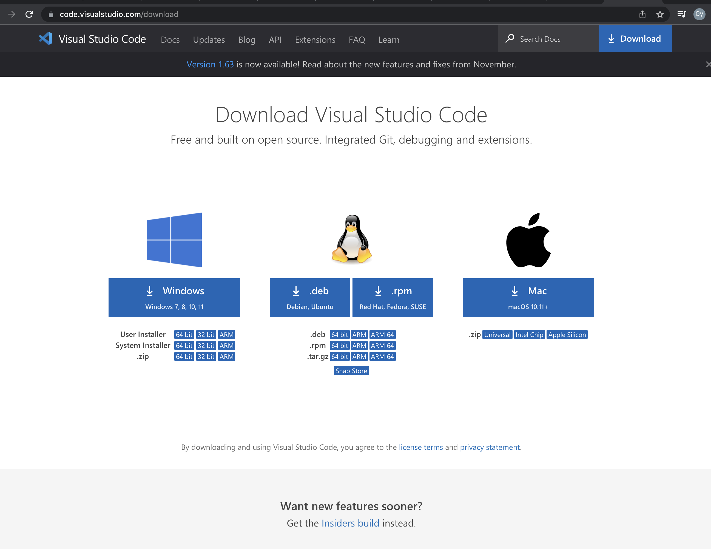
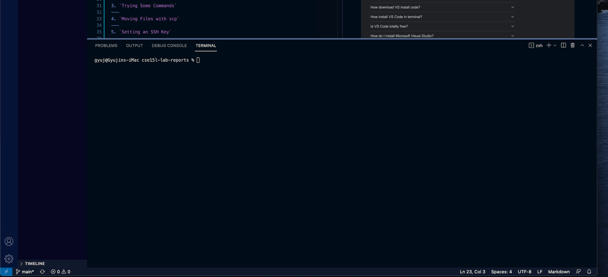
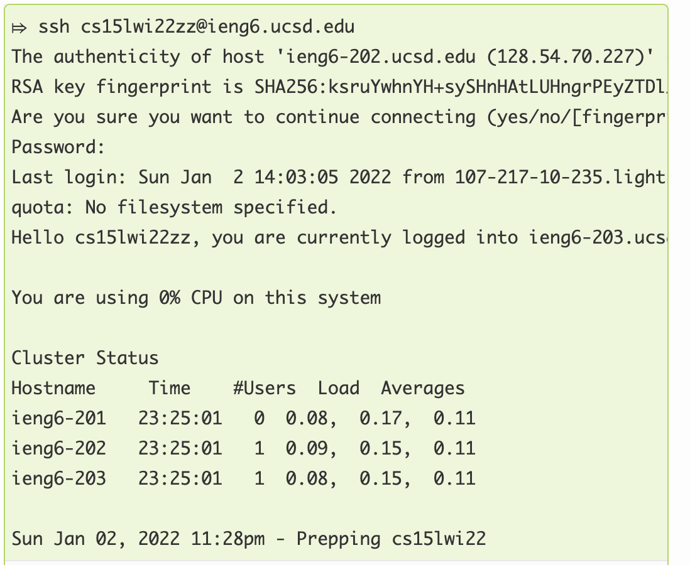
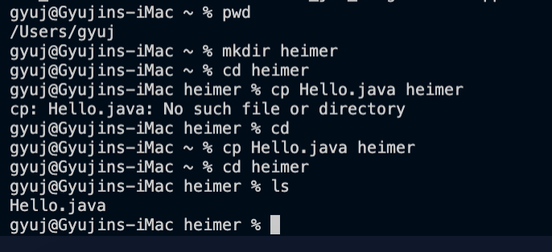
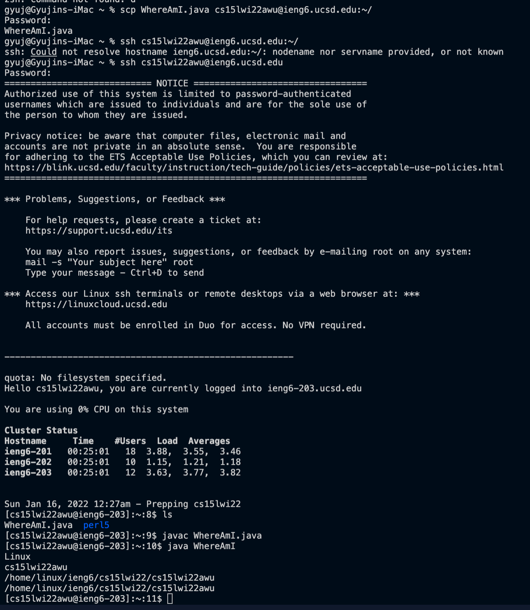
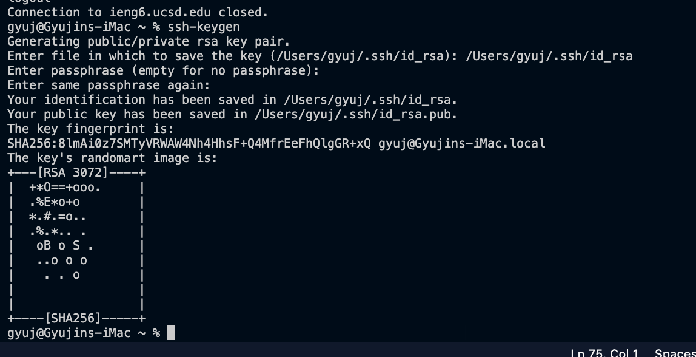
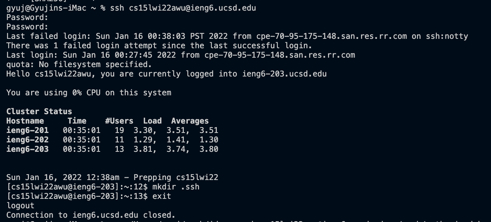
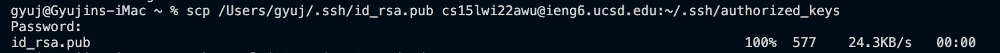
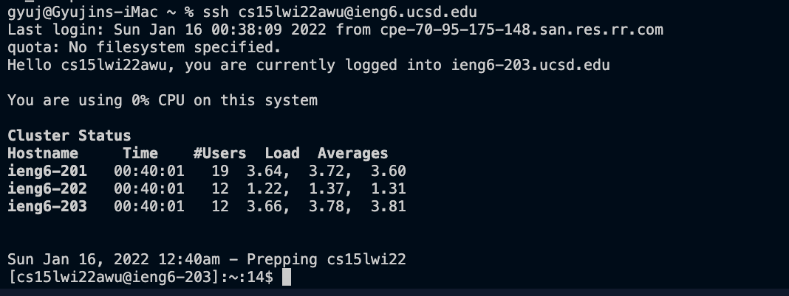

# CSE 15L Lab Report 1
## Remote Access

-------


*Steps on how to log into a course-specific account on ieng6 through remote access using ssh*

---

1. `Installing VScode`

The first step to remote access and setting up an environment for coding in your CSE 15L class is installing VS code.

> Use this link to download VScode onto your local client: 
[Download Visual Studio Code](https://code.visualstudio.com/download) 

> Download the compatiable version for your remote device.



> Navigate your cursor to the bottom of the vscode application.

> Drag up the terminal to access it.

> This is where you can connect to a remote computer through ssh. 


---
2. `Remotely Connecting`

Once you have located the terminal, make sure your course-specific account is ready for remote connection by resetting your course account password through this  link:

[Course-specific Account Lookup](https://sdacs.ucsd.edu/~icc/index.php)

After your account is set-up, give you a few minutes for your password to be updated. 

> Now that you have your account information, type in 

> $ssh followed by your course title, current quarter, followed by your unique id in replace of 'zz' as shown below. 
> You can type in 'yes' and hit enter to the prompt below, and type in your password after.


---
3. `Trying Some Commands`

There are some main linux commands to run on the terminal. Try this out in your terminal. 

Some commands you can try out are:
* cd (change directory)
* pwd (print working directory)
* cp (copy)
* mkdir (make directory)
* ls (list files and directories)

> Below are examples of the linux commands in use at the terminal.

> The current directory is printed, a new directory heimer is created, and the Hello.java file from the Desktop is copied into the new directory.

---
4. `Moving Files with scp`


One key step in *working remotely* is being able to copy and move files between the local and remote computers. 

We do this by the $scp command, followed by the file name and remote server location we want to copy the local file to.

> Below we used the scp command to copy WhereAmI.java from our local client to our remote server.



---
5. `Setting an SSH Key`

In this step, we will be utilizing the ssh-keygen program to avoid typing in our password every time we log into ssh or run scp. 

The idea behind this is that this program creates two files, a *public key* and *private key*. 

The public key is copied to our remote server, and the private key is saved somewhere in our local client. The ssh command that is bound can use the saved files instead of our password. It will help us skip the step of always typing in our passwords. 

> Command to generate ssh-keygen


> Making the directory to copy the public key


> Copying over the public key to remote server from local client


> Now you are finished- here is an easier log-in attempt without having to type in your password!


---
6. `Optimizing Remote Running`

There are a few ways to enhance your remote code running experience. Some of those are:

* Writing a command in quotes at the end of an $ssh command to run the command remote directly.

* Using semicolons to run multiple commands can also save you time.

* You can also use the up-arrow on your keyboard to bring back your most recent command, without having to type it again. 


```
// These were some tips to making remote coding easier for yall! Hopefully you guys enjoyed this tutorial and have lots of fun in this class! 
:)
Stay safe 

```

---


