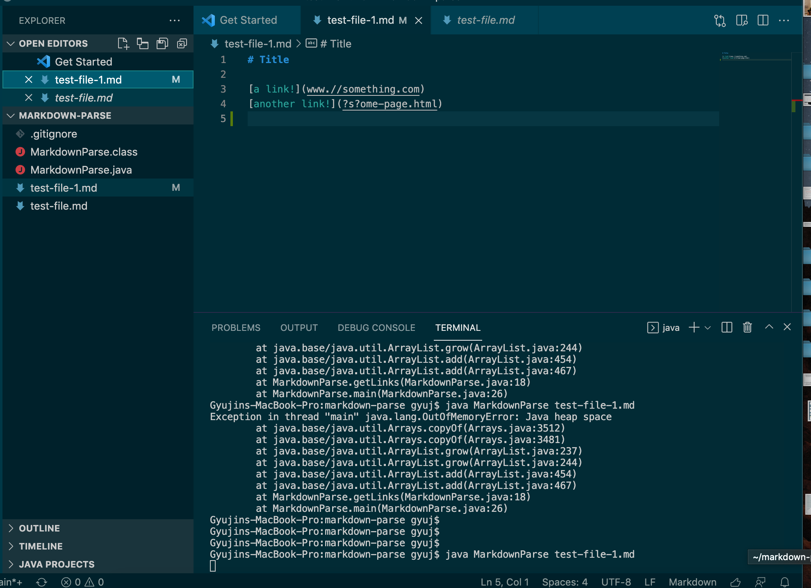

# Week 4 Lab Report 4
## Testing and Debugging

---

* This week's lab report will be on the steps taken to fix a bug with markdown file parsing.

1. Test Case 1 
> We created a new markdown test file to test some error cases out, and below is test-file-1.md

> Link to test-file-1
*link from github*

> Because we added in an extra line after the last link, it led to an infinite loop
> The below screenshot shows the 6 additional lines of changes that were taken to catch this bug

> Because of the extra line, the compiler ran through the markdownparse file to the empty line
> Searched for the beginning mark of the link, but could not find it. 
> This led to an inifinite loop, causing the java runtime to fail out of memory space.

3. Test Case 2
4. Test Case 3

