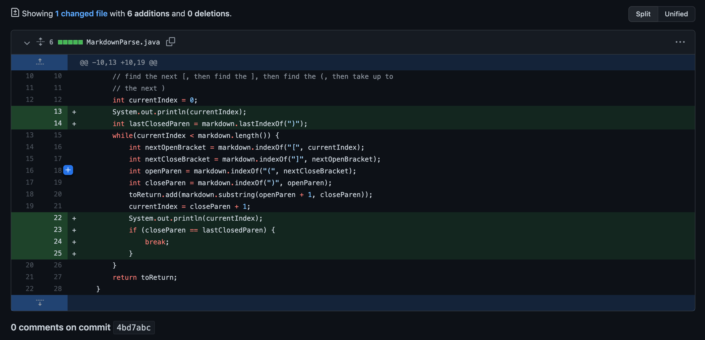
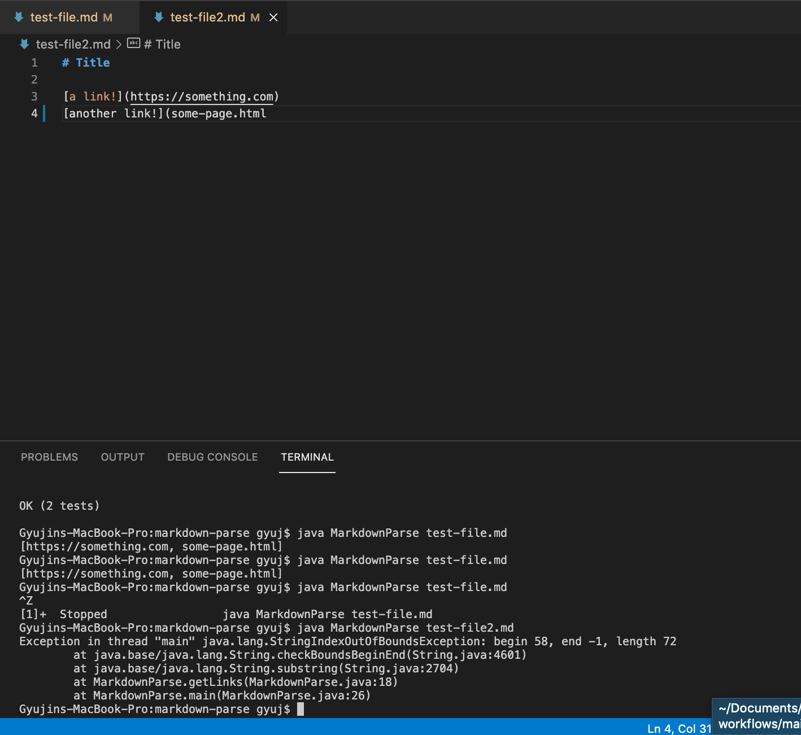
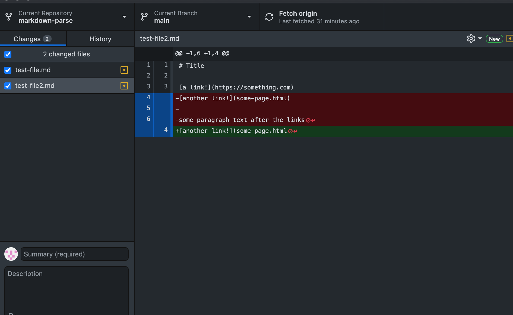
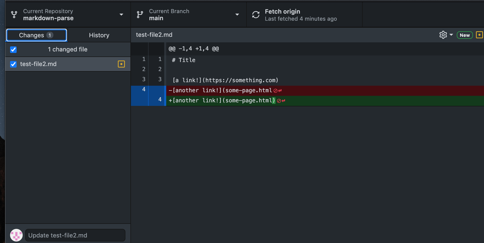
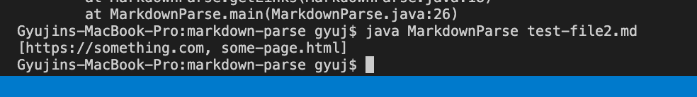
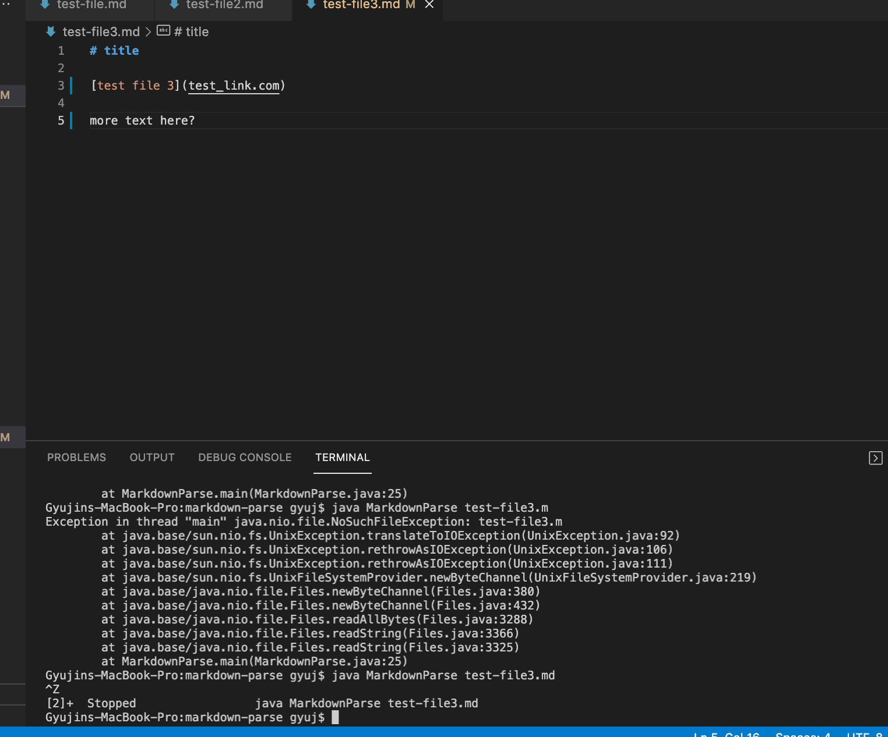
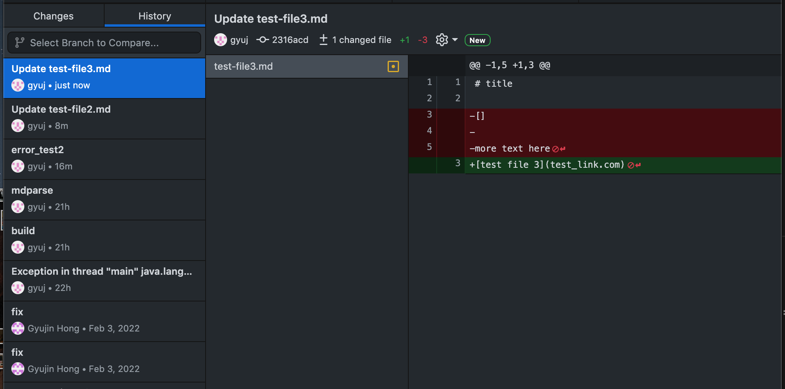

# Week 4 Lab Report 2
## Testing and Debugging

---

* This week's lab report will be on the steps taken to fix a bug with markdown file parsing.

1. Test Case 1 
> We created a new markdown test file to test some error cases out, and below is test-file-1.md

> Link to test-file-1
[error_test_1](https://github.com/gyuj/markdown-parse/blob/main/test-file.md)

> Because we added in an extra line after the last link, it led to an infinite loop
> The below screenshot shows the 6 additional lines of changes that were taken to catch this bug
> Error Fix #1

> Because of the extra line, the compiler ran through the markdownparse file to the empty line
> Searched for the beginning mark of the link, but could not find it. 
> This led to an inifinite loop, causing the java runtime to fail out of memory space.

2. Test Case 2 
> Another file to test error inducing output is test-file2.md

> Link to test-file2
[error_test_2](https://github.com/gyuj/markdown-parse/blob/main/test-file2.md)

> Because we were missing a ending parenthese to mark the end of a link, the compiler ran to a 
> IndexOutOfBounds exception.
> The below screenshot shows the added bracket and the fixed output from github desktop
> As well as successful compiling of the fixed output on VSCode.

> Github Desktop #2

> VSCode

3. Test Case 3
> Third file to test error inducing output is test-file3.md

> Link to test-file3
[error_test_3](https://github.com/gyuj/markdown-parse/blob/main/test-file3.md)

> Because we had additional nonlink lines below are link address, the compiler ran into 
> an infinite loop. 
> We caught this bug by getting rid of the extra unnecessary lines at the end in the markdown file. 
> Below is the screenshot of the fix 
> Github Desktop Fix #3

