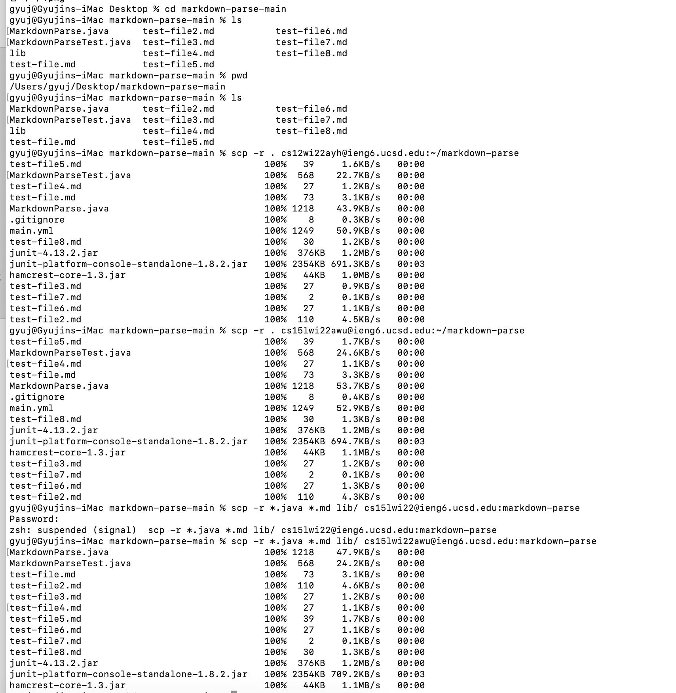
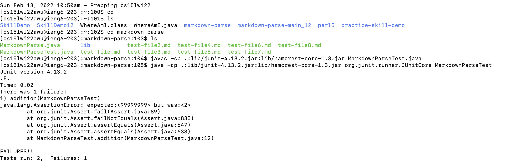
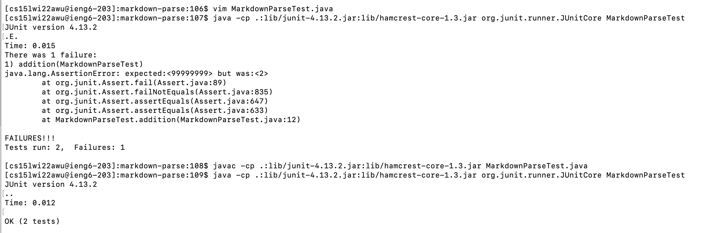
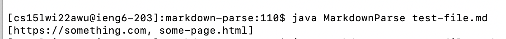

# Week 6 Lab Report 3
## Option 3: Copy whole directories with scp -r

---

`In this lab, we will show how to copy our whole
markdown-parse directory to our ieng6 account.`

--- 
___

1. Using the scp -r command, we copied the whole markdown-parse directory to our ieng6 account.

> Below is the screenshot of the scp -r into our ieng6 account. 

> There was an initial mistake at doing so, because I accidentally copied the directory into the cs12 ieng6 account, but that issue was fixed. 

> The ~/markdown-parse at the end of this scp command creates the new directory under that name in the destination location host if the directory does not exist already.

___

2. After securely logging into our ieng6 account, we can see that the markdownparse file and the test files exist in the correctly created directory, and that we can run our java compiler with those files. 

> There was another mistake made within running our test-file.md with our mardownparse tester, because the addition assert test was not corrected to 2 when we checked with 1+1. 

> That issue was resolved, and we have markdownparse file and its tester compiling successfully now. 

> After fixing and running the tester, we see that the test-file.md is returning the correct output when executed with our markdownparse code.

___

3. 