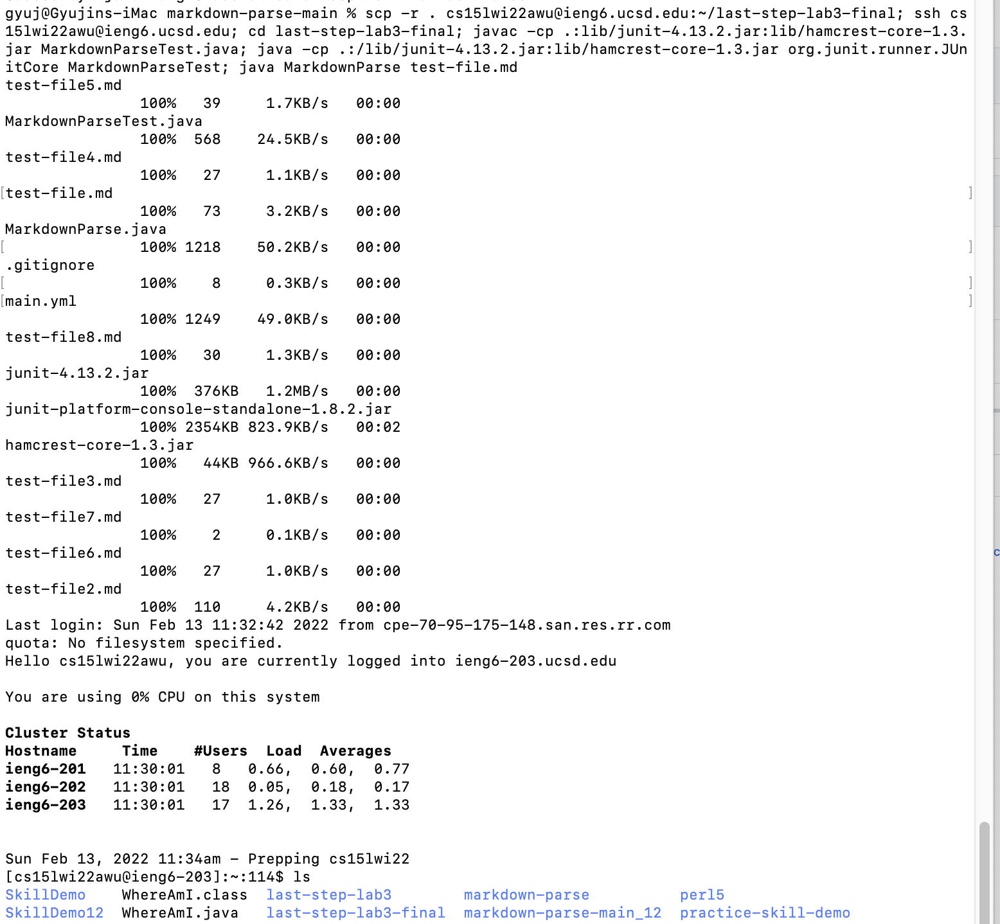
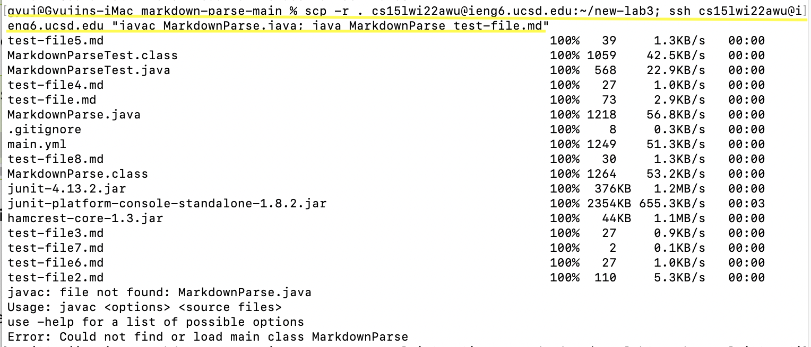

# Week 6 Lab Report 3
## Option 3: Copy whole directories with scp -r

---

`In this lab, we will show how to copy our whole
markdown-parse directory to our ieng6 account.`

--- 
___

// 1. Using the scp -r command, we copied the whole markdown-parse directory to our ieng6 account.

> Below is the screenshot of the scp -r into our ieng6 account. 

> There was an initial mistake at doing so, because I accidentally copied the directory into the cs12 ieng6 account, but that issue was fixed. 

> The ~/markdown-parse at the end of this scp command creates the new directory under that name in the destination location host if the directory does not exist already.

___

// 2. After securely logging into our ieng6 account, we can see that the markdownparse file and the test files exist in the correctly created directory, and that we can run our java compiler with those files. 

> There was another mistake made within running our test-file.md with our mardownparse tester, because the addition assert test was not corrected to 2 when we checked with 1+1. 

> That issue was resolved, and we have markdownparse file and its tester compiling successfully now. 

> After fixing and running the tester, we see that the test-file.md is returning the correct output when executed with our markdownparse code.

___

// 3. The last step of this lab was to combine the commands of scp and ssh using ; to decrease the number of keystrokes as we learned in lab 1. 

> We simply wrote in the command line for scp -r into a different directory name and following ; right after, we inputed the command to ssh into our ieng6 account. 

> We were able to run this with just one line of code.
> However, the below combined command did not test out our test file as we had intended, because of incorrect usage of the ; and "" marks for correct command after the ssh command.

> Attempt 1: Another attempt was made to fix this issue;
> We tried to use the "" after the ssh command to run our java command on the ssh remote host and exit right after. However, the problem here was that we had not run the javac command to compile our MarkdownParse earlier.

> Attempt 2: The second attempt was made with the javac command and the java command following right after, using the ; to combine the two commands after our ssh command.
> It failed to give the wanted output again, because compiling MarkdownParse needed to be called as the MarkdownParse.java file. 

> Attempt 3: The third attempt was made with the correct calling of MarkdownParse.java file after the javac command, but this time, we realized that we were not in the correct directory of the new-lab3 we coped the markdownparse directory into. 

> Attempt 4: The fourth attempt was made with copying our directory into the new-lab3 that we copied the markdownparse directory in our remote access, and tried running our javac and java commands for the MarkdownParse files. However, this time the problem was not using the correct javac command that called forth the junit libraries. 

> Attempt 5: The fifth attempt was made with the correct javac and java commands of the junit libraries as provided from class. However, this attempt failed to give the wanted output as well. 
