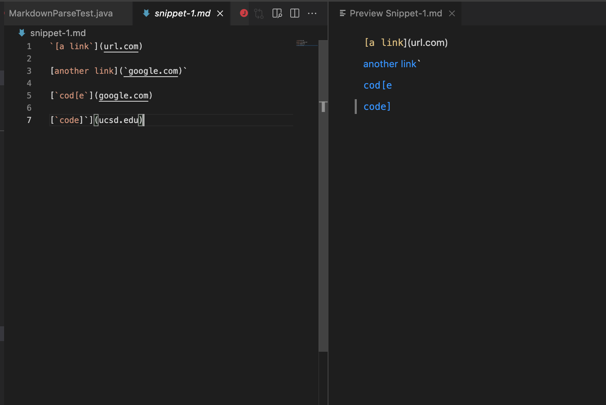
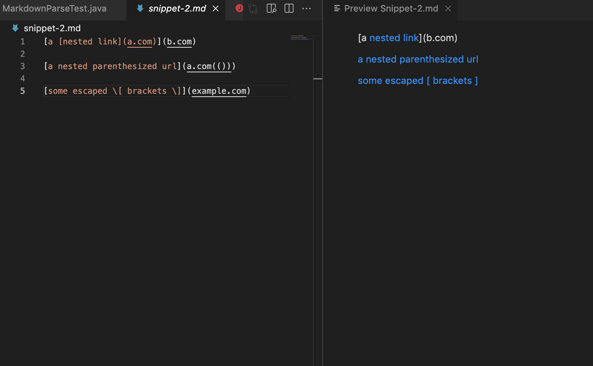
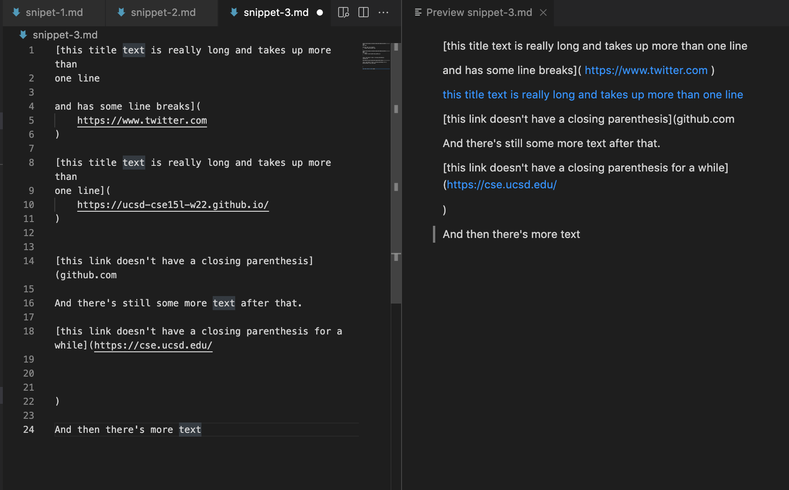
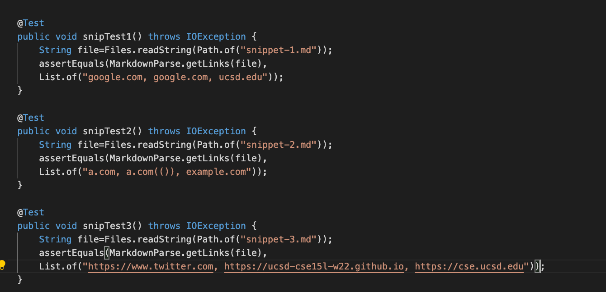
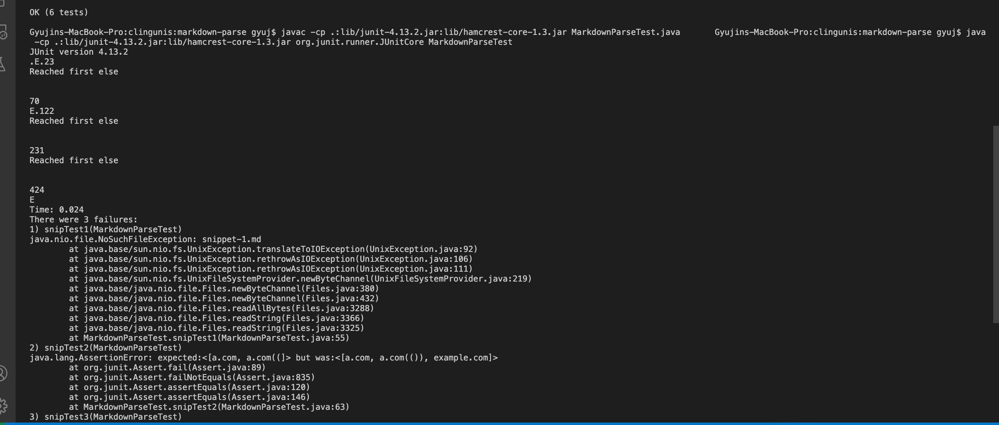
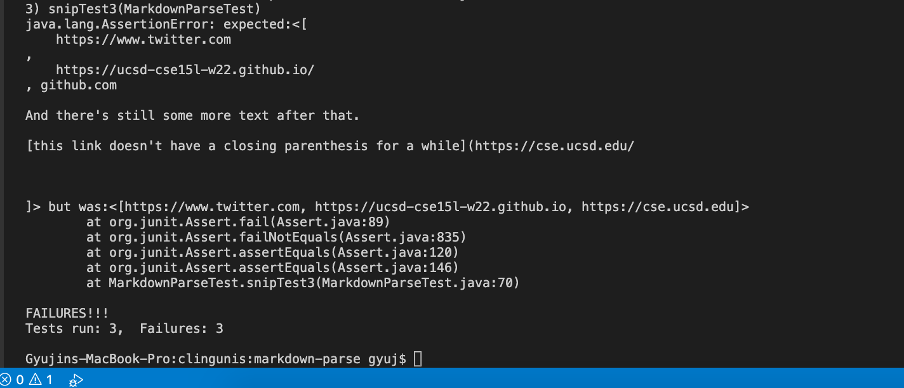
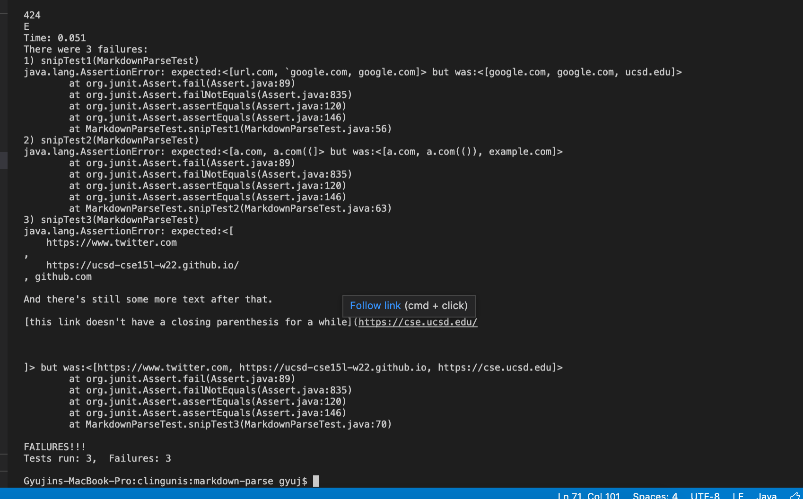

# Week 8 Lab Report 4
## Debuggers and Snippets

---

`In this lab, we will show how to run tests for our markdown snippets
using our JUnit tests and compare our MarkdownParseTest with other tests.`

___

// Links to personal and other mdp

[This is the link to my implementatin of mdp](https://github.com/gyuj/markdown-parse.git)
[This is the link to the other groups implementation of mdp from Week 7: clingunis ](https://github.com/clingunis/markdown-parse.git)
___

// Preview of snippets on what they should look like

// How to test the snippets in our MardownParseTest.java

___

// Below are the corresponding outputs when running the two tests on the three snippets

> For my implementation, 

> the three tests failed for all three snippets
> It seems to have been caused by an extra url.com being printed in addition to the normal link arguments passed in.

> For the other implementation, 

> The three tests failed for all three snippets again. 
> The cause for this time seems to have been the snippet #1 not being named correctly the previous time, snippet #2 not printing the last "example.com" link, and snippet #3 printing the links in awkward spacings. The other group also added a note for identifying errors, where they printed the link not including a closing parentheses. That was helpful.

> Renamed the first snippet to correctly run the test, saw that the error in snippet #1 was caused by the first link having an extra "url.com" as identified in my own implementation, and missing the last link, "ucsd.edu" at the end.

___

// Questions answered from lab instructions

`1. Do you think there is a small (<10 lines) code change that will make your program work for snippet 1 and all related cases that use inline code with backticks? If yes, describe the code change. If not, describe why it would be a more involved change.`

`2. Do you think there is a small (<10 lines) code change that will make your program work for snippet 2 and all related cases that nest parentheses, brackets, and escaped brackets? If yes, describe the code change. If not, describe why it would be a more involved change. `

`3. Do you think there is a small (<10 lines) code change that will make your program work for snippet 3 and all related cases that have newlines in brackets and parentheses? If yes, describe the code change. If not, describe why it would be a more involved change.`

