# Week 10 Lab Report 5
## Comparing commonmark-spec Tests

In this lab report, we will try to implement the commonmark-spec tests with our implementation for markdown parsing and the given code for markdown parsing to compare the outputs of each, identifying the bugs of the tests, and fixing the bugs with code change.

// First, I tried to find the previous MarkdownParse.java implementation where the commonmark-spec tests with the most recent code for the getLinks method class file had not yet been updated. 

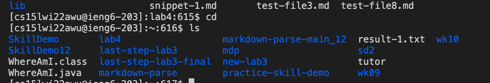

// By using the command-line ls, I looked at my library to find which one could still run its MarkdownParse.java without any errors. Out of new-lab3, markdown-parse-main_12, mdp, wk09, and wk10, only mdp and wk09 seemed to be running its tests. 

1. checking new-lab-3, failed tests from runtime error
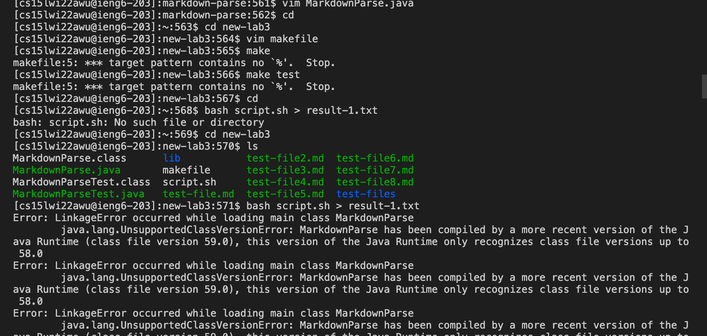

2. checking markdown-parse_12, failed tests from the MarkdownParse.java being too far behind with its getLinks methods.
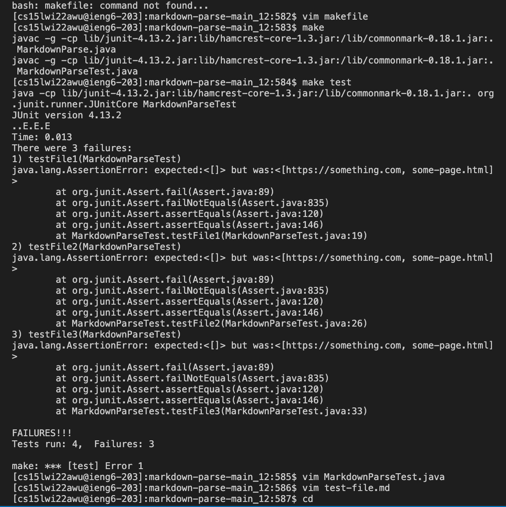

3. checking wk09, after ls to check, we ran the make tests and saw that the MarkdownParse.java was running fine for this file.
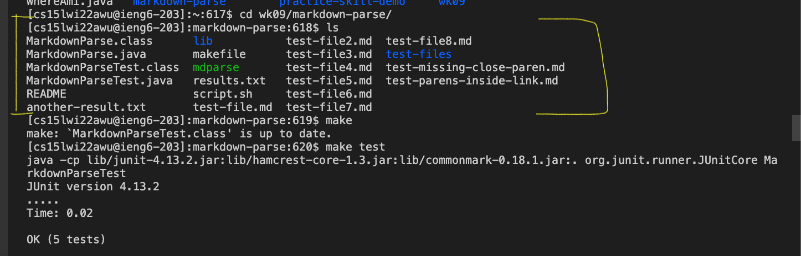

4. checking wk10, failed tests from runtime error
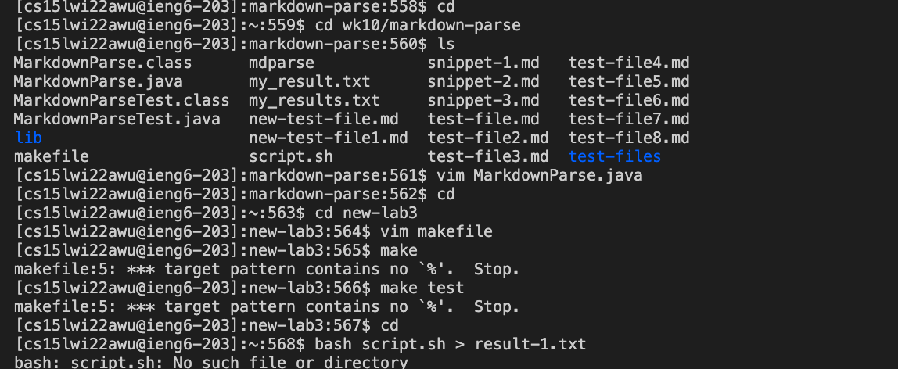

// After identifying which files we were able to run successfully and compare our bash results with, I used the command

```
diff my_results.txt results.txt
```
To compare the outputs of wk09 and mdp file that ran within the mdp directory.
However, as seen below, the diff command did not give us any differences in output.
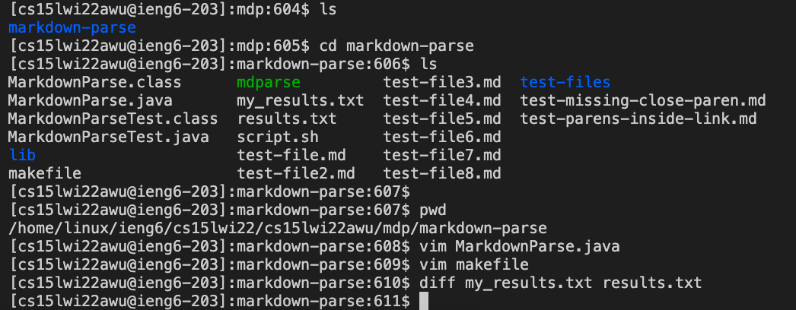

// Wondering if it was because of the makefile java commands being the same for both the MarkdownParse.java files in the wk09 and mdp directories, I checked the makefile code for wk09, and found the below. 
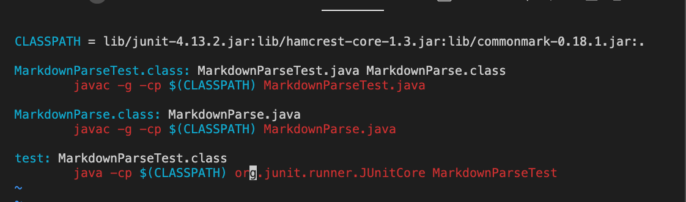

// Wondering if excluding the commonmark spec additional library for one of the directories running their bash commands, I changed the makefile classpath line for the one in the mdp directory, keeping the wk09 directory as is. 
After doing so, I ran the make test commands again to check. 
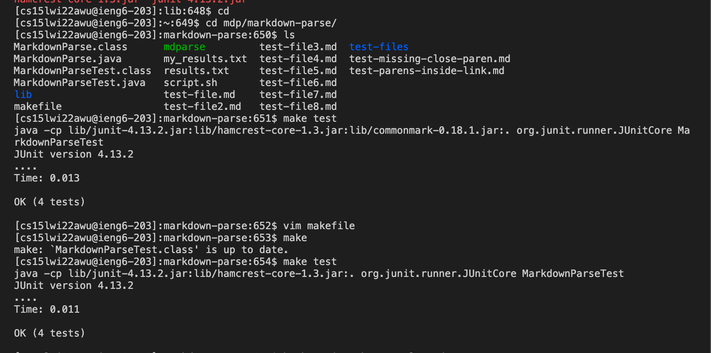

// However, they both gave the same outputs once again after comparing with the diff command. The wk09 and mdp directories seemed to be giving the same outputs, so I could not find the differences in bugs for the different implementations.


// I will manually find the bugs within one of the directory andthen attempt to explain what code changes would be necessary to catch the bug. 

___


> Below, I am looking at the result.txt and searching for incorrect outputs manually. 
> I chose 499 and 500. 
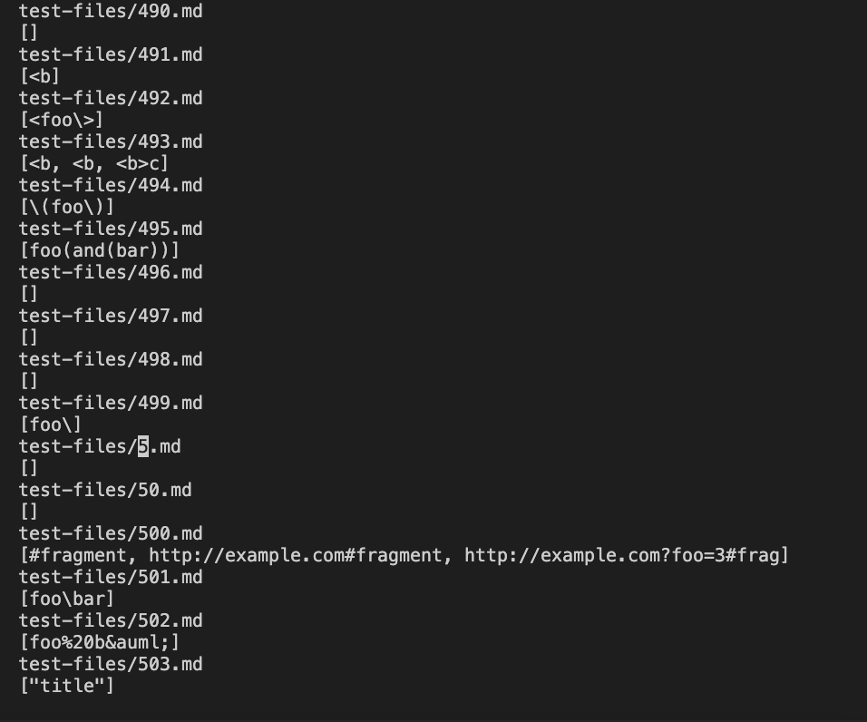

## First Example - 499.md
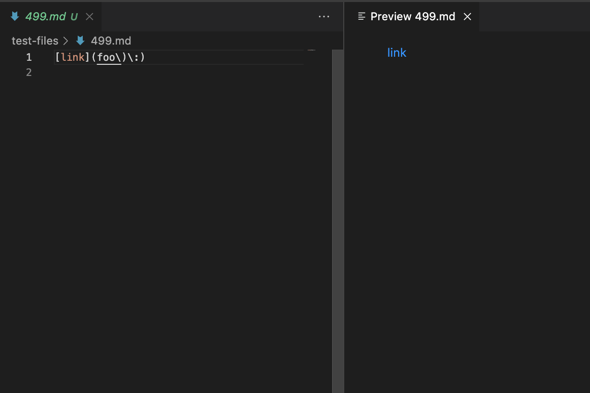

We can see that the link is created in the VSCode preview.
Also through the cat command, we can look inside the test-file of 499.md.
We can see that the correct expected output should be [], 499.md being a broken link that shouldn't be able to save anything.
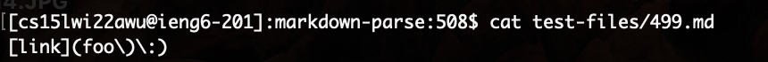

However, the output with the markdownparse file we observed was what we saw through the cat command, and the output text was differing to what we expected.

***The bug that should be fixed***

This bug was probably caused by either the stray slashes being doubled up incorrectly, or the incorrect usage of the colon. This colon could be possibly caught in our MarkdownParse java code by checking for it within the getLinks method, whether it existed. As for the slashes, we can also check for it, and disregard those slash characters from being incorrectly included within the links. 


## Second Example - 500.md
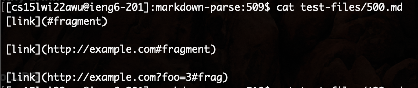

For this test file, we can see that the three links also included within this markdown file should not be ran through, and should return the correct expected output of []. This is becaue of the # that begins the links enclosed within the parentheses. 

***The bug that should be fixed***

We need to catch the # that begins the enclosed links within the parenthese. This bug might have occurred because we didn't put into consideration what # could do to our markdownparse getLinks method and the results that we passed out using the method. It might be a good idea to check for where the # sign begins, or put stricter constraints to checking where the correct link string began and ended, without including the random characters. 


